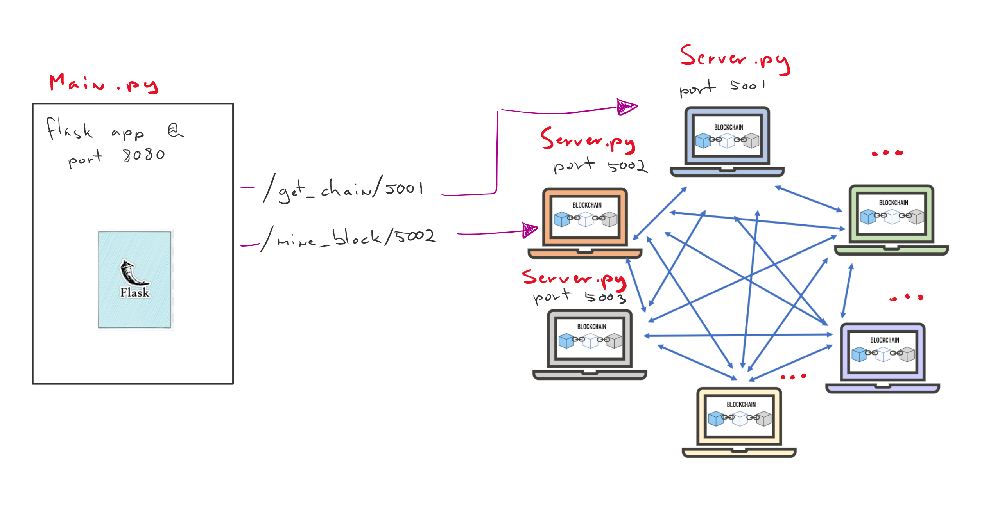

Proof-of-Work Based Blockchain
==============================

`Python` based decentralised blockchain application using a P2P network to
distribute the ledger and a flask interface to probe the network.

Usage
------------

Run the flask interface::

    python main.py

Run a few P2P nodes::

    python server.py 5001
    python server.py 5002
    python server.py 5003

Probe the network using the flask interface::

  #todo

The servers will auto synchronise to the longest valid chain

Blockchain
----------

implemented with a python deque collection as it's optimised for pop/push
(perfect for blockchain)

Block
------

Genesis Block
_____________

Origin of the blockchain. A genesis block is available
as a property. Our genesis block is hardcoded with dummy values
for the `timestamp`, `nonce`, `data` and `prev_hash`.

.. code-block:: python

    @property
    def genesis_block(self):
        if not hasattr(self, '_genesis_block'):
            genesis_block = Block(prev_hash='0000', data={})
            setattr(self, '_genesis_block', genesis_block)
        return getattr(self, '_genesis_block')

Block Fields
____________

:index:     current block's chain index
:timestamp: (req) UTC TimeZone - string format: "%d/%m/%Y, %H:%M:%S"
:nonce:     (req) Integer value added to the hashed block so that, when rehashed,
            meets the difficulty level restrictions
:previous hash: (req) Hash value of the previous block in the chain
:current hash:  Used for debugging - next block will compute this block's hash
                instead of assessing this field
:data:      (req) JSON formatted, sorted by key name, data to be stored in the
            blockchain

Peer-to-Peer Network
--------------------

The peer-to-peer network is comprised of multiple servers (server.py)
interconnected using sockets and a flask interface that is used to probe
individual nodes in the network.

Each node in the peer-to-peer network will subscribe itself to the list of
running nodes in the network for as long as the server is running and unsubscribe
itself if gracefully terminated.

The nodes in the network will send/receive utf-8 encoded bytes where the
first `10 characters` are reserved for the header and indicate the message size.

.. code-block:: python

  valid_message = bytes('13        Valid message', 'utf-8'))

.. code-block:: python

  HEADER_SIZE = 10

  client = socket.socket(socket.AF_INET, socket.SOCK_STREAM)
  client.connect(('localhost', 5001))

  msg = repr(blockchain)
  msg = f'{len(msg):<{HEADER_SIZE}}{msg}'

  client.send(bytes(msg, 'utf-8'))
  msg = client.recv(1024)

Flask API
---------

.. code-block:: python

  # Mining a new block
  @app.route('/mine_block/<port>', methods=['POST'])

  # Getting the full Blockchain
  @app.route('/get_chain/<port>', methods=['GET'])

  # Checking if the Blockchain is valid
  @app.route('/validate/<port>', methods=['GET'])

  # Shutdown a node
  @app.route('/shutdown/<port>', methods=['GET'])

