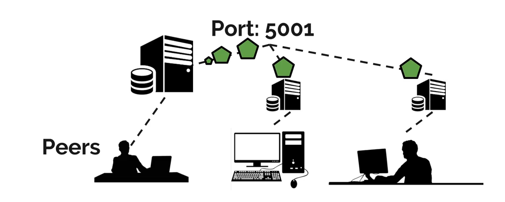

**DRAFT v1.1**

Proof-of-Work Based Blockchain
==============================

`Python` based decentralised blockchain application using a P2P network to
distribute the ledger and a flask interface to probe the network.

Usage
------------

.. code-block:: python

    python main.py

Run the flask interface
Run a few P2P nodes

Blockchain
----------

implemented with a python deque collection as its optimised for pop/push
(perfect for blockchain)

Block
------

Genesis Block
_____________

Block Fields
____________

:index:     current block's chain index
:timestamp: (req) UTC TimeZone - string format: "%d/%m/%Y, %H:%M:%S"
:nonce:     (req) Integer value added to the hashed block so that, when rehashed,
            meets the difficulty level restrictions
:previous hash: (req) Hash value of the previous block in the chain
:current hash:  Used for debugging - next block will compute this block's hash
                instead of assessing this field
:data:      (req) JSON formatted, sorted by key name, data to be stored in the
            blockchain

Peer-to-Peer Network
--------------------

Every P2P node in the network will send/receive utf-8 encoded bytes where the
first `10 characters` are reserved for the header and indicate the message size.

.. code-block:: python

  valid_message = bytes('13        Valid message', 'utf-8'))

Example:

.. code-block:: python

  HEADER_SIZE = 10

  client = socket.socket(socket.AF_INET, socket.SOCK_STREAM)
  client.connect(('localhost', 5001))

  msg = repr(blockchain)
  msg = f'{len(msg):<{HEADER_SIZE}}{msg}'

  client.send(bytes(msg, 'utf-8'))
  msg = client.recv(1024)

Flask API
---------

